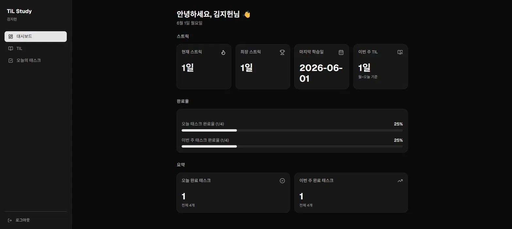
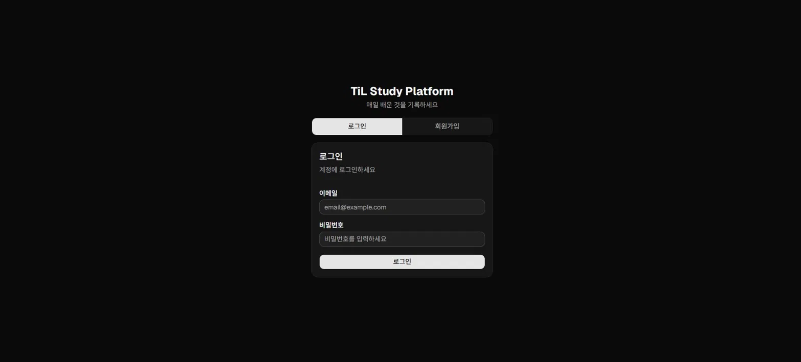
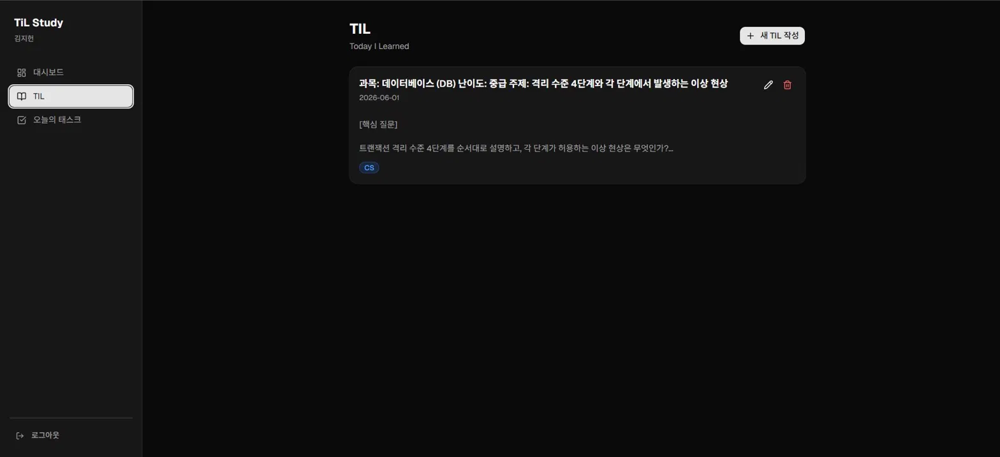
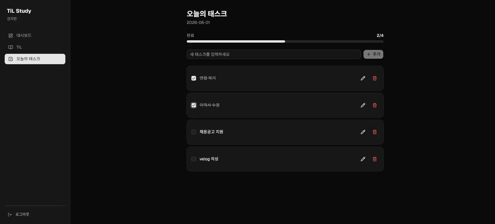

# TiL Study Platform

> 매일 배운 것을 기록하고, 학습 습관을 시각화하는 개발자 TIL & 스터디 인증 플랫폼



---

## 프로젝트 소개

개발자가 매일 공부한 내용을 TIL(Today I Learned)로 기록하고, 학습 태스크 완료율과 스트릭(연속 학습일)을 통해 꾸준한 학습 습관을 시각화하는 풀스택 웹 서비스입니다.

본 프로젝트는 단순한 CRUD 구현을 넘어, **AI 에이전트(Claude Code)를 통제 가능한 구조로 운영하는 개발 방법론을 실험·체득하는 것**을 핵심 목표로 진행했습니다.

### 핵심 기능

- **TIL 작성**: 하루 1개, 마크다운 기반 학습 기록 (CS/알고리즘/백엔드/프론트엔드 카테고리)
- **스트릭 추적**: TIL 작성 시 연속 학습일 자동 계산 및 최장 기록 갱신
- **학습 태스크**: 오늘 공부할 항목 등록 및 완료 체크
- **학습 통계**: 현재/최장 스트릭, 오늘·이번 주 태스크 완료율 대시보드
- **JWT 인증**: Access Token + Refresh Token 기반 자동 갱신

---

## 개발 방법론 — 하네스 엔지니어링 기반 AI 협업

이 프로젝트의 가장 큰 특징은 **하네스 엔지니어링(Harness Engineering)** 방법론을 도입해 AI 에이전트를 통제 가능한 구조로 운영했다는 점입니다.

### 왜 하네스 엔지니어링인가

Claude Code 같은 AI 에이전트에게 "이 기능 만들어줘"라고 지시하면 그럴듯한 코드를 빠르게 생성합니다. 하지만 다음과 같은 문제가 자주 발생합니다.

- 세션이 바뀌면 이전 결정 사항을 잊어버림
- 통과시키기 위해 테스트를 임의로 삭제하거나 약화시킴
- 동작은 그럴듯하지만 실제로 검증되지 않은 코드를 "완료"로 선언
- 자기가 짠 코드를 자기가 리뷰하며 편향된 판단

이 문제들을 막기 위해 AI를 "통제하는 작업대(harness)"를 설계하고 그 위에서 개발을 진행했습니다.

### 세 가지 핵심 원리

**원리 1 — 파일을 진실의 원천으로 삼는다**

계획, 스펙, 진행 상태를 휘발성 채팅창이 아닌 `docs/` 하위 파일에 기록합니다. 세션이 초기화되거나 컨텍스트가 비워져도 작업 상태가 유지됩니다.

```
docs/
├── SPEC.md         # 합의된 기능 스펙 (MVP 범위, 설계 결정)
├── plan.md         # 현재 진행 중인 작업 계획
├── progress.txt    # 작업 히스토리 로그 (세션 간 연속성)
└── features.json   # 불변 요구사항 (AI가 임의 수정 불가)
```

**원리 2 — Plan, Work, Review를 분리한다**

각 단계를 별도 컨텍스트에서 수행해 작성자 편향을 제거합니다.

```
Plan 단계   → 무엇을 왜 만들지 결정. plan.md에 Scope/완료기준/미지수/중단조건 명시
Work 단계   → 승인된 plan.md 기반 TDD 구현
Review 단계 → 새 컨텍스트에서 보안/성능/아키텍처 검증
```

특히 Review를 Work와 다른 세션에서 수행해, 방금 코드를 짠 AI가 자기 코드에 편향되지 않도록 분리했습니다.

**원리 3 — 강제는 도구로, 의도는 문서로**

반드시 지켜져야 할 규칙은 결정적으로 강제하고, 권장사항은 문서로 조언합니다. "잘 부탁한다"는 강제가 아닙니다.

```
강제 (도구로)
- features.json 불변 요구사항 (AI의 임의 수정 차단)
- TDD: 테스트 통과 없이 완료 선언 금지
- typecheck/lint 실패 시 작업 중단

조언 (문서로)
- CLAUDE.md의 코드 스타일 가이드
- 레이어 경계, DTO/Mapper 사용 권장
```

### 실제 워크플로우

각 기능을 다음 사이클로 진행했습니다.

```
1. SPEC.md 합의 (이번 기능의 범위와 설계 결정)
2. plan.md 작성 (Scope, Acceptance Criteria, Unknowns, Stop Conditions)
3. 사용자 승인 후 Work 단계 진입
4. TDD: 실패 테스트 → 최소 구현 → 통과 → 리팩토링
5. Work 종료 후 별도 세션에서 Review
6. progress.txt 갱신 및 커밋
7. 발견한 함정을 CLAUDE.md에 누적 (다음 기능에서 같은 실수 방지)
```

### TDD와 하네스의 차이

> **TDD는 코드의 정확성을 보증하고, 하네스는 AI의 행동을 통제한다.**

TDD는 "이 코드가 올바르게 동작하는가"를 검증하는 방법입니다. 하네스 엔지니어링은 그보다 한 단계 위, "AI 에이전트가 올바르게 일하도록 통제하는 구조"를 의미합니다. 본 프로젝트에서 TDD는 하네스의 Work 단계 안에서 동작하는 검증 메커니즘으로 사용되었습니다.

### 적용 결과

이 방법론을 적용함으로써 얻은 구체적 효과는 다음과 같습니다.

- **세션 간 연속성**: 컨텍스트가 초기화되어도 `progress.txt`로 즉시 이어가기 가능
- **AI의 임의 행동 차단**: `features.json` 불변 제약으로 요구사항 변조 방지
- **검증된 완료**: 81개 통합 테스트로 동작이 입증된 코드만 커밋
- **편향 없는 리뷰**: Work/Review 컨텍스트 분리로 객관적 검증
- **학습 누적**: 발견한 함정을 CLAUDE.md에 누적해 같은 실수 반복 방지

---

## 스크린샷

| 로그인 | 대시보드 |
|--------|----------|
|  |  |

| TIL 목록 | 오늘의 태스크 |
|----------|--------------|
|  |  |

---

## 기술 스택

### 백엔드
| 기술 | 용도 |
|------|------|
| Node.js + TypeScript | 런타임 / 언어 (strict 모드) |
| Express | 웹 프레임워크 |
| Prisma 7 + PostgreSQL | ORM / 데이터베이스 |
| Zod | 요청 유효성 검증 |
| JWT (jsonwebtoken) | Access Token + Refresh Token 인증 |
| bcrypt | 비밀번호 해싱 |
| Jest + Supertest | 통합 테스트 (81개) |
| Swagger | API 문서 자동화 |
| Docker Compose | 로컬 개발 환경 |

### 프론트엔드
| 기술 | 용도 |
|------|------|
| React 19 + TypeScript | UI 프레임워크 |
| Vite 8 | 빌드 도구 |
| Tailwind CSS v4 | 스타일링 |
| shadcn/ui | UI 컴포넌트 |
| TanStack Query | 서버 상태 관리 |
| Axios | HTTP 클라이언트 |
| React Router v6 | 클라이언트 라우팅 |

---

## 주요 구현 포인트

### 1. JWT Access Token + Refresh Token 인증

Access Token(15분) 만료 시 Refresh Token(7일)으로 자동 재발급하는 인증 구조를 구현했습니다.

- Axios 인터셉터에서 401 응답을 감지해 Refresh Token으로 재발급 후 원래 요청을 자동 재시도
- Refresh Token은 DB에 해시값으로 저장하고 로그아웃 시 즉시 무효화
- JWT에 `jti`(JWT ID)를 포함해 같은 초에 발급된 토큰이 동일해지는 로테이션 버그 방지

### 2. TIL 작성 시 스트릭 즉시 계산

TIL 작성 시점에 스트릭을 즉시 계산하는 로직을 구현했습니다.

```
어제 TIL 있음  → currentStreak + 1
오늘 이미 작성 → 변경 없음 (중복 방지)
그 외          → currentStreak 1로 리셋
longestStreak  → currentStreak의 최댓값으로 항상 갱신
```

- `@@unique([userId, date])` 제약으로 DB 레벨에서 하루 1개 TIL을 강제
- 날짜 기준은 서버 UTC로 통일해 타임존 이슈 제거

### 3. 이번 주 통계 — 요일 기반 주 계산

"이번 주"를 오늘 포함 7일이 아닌 **월~일 요일 기준**으로 계산합니다.

```typescript
// getUTCDay()는 일요일=0이므로 단순 계산 시 버그 발생
// (dayOfWeek + 6) % 7 로 월=0, 일=6으로 재매핑
const monday = new Date(today);
monday.setUTCDate(today.getUTCDate() - (today.getUTCDay() + 6) % 7);
```

사용자가 "이번 주"를 월~일로 인식하기 때문에, 오늘 기준 슬라이딩 윈도우보다 직관적입니다.

### 4. Prisma 7 Driver Adapter

Prisma 7부터 `new PrismaClient()` 직접 생성 방식이 deprecated되어 `PrismaPg` Driver Adapter를 사용합니다.

```typescript
const adapter = new PrismaPg({ connectionString });
const prisma = new PrismaClient({ adapter });
```

### 5. TDD 기반 개발 (81개 통합 테스트)

모든 백엔드 기능을 TDD(Red → Green → Refactor) 사이클로 구현했습니다.

- 실패하는 테스트를 먼저 작성하고 통과하는 최소 구현을 작성
- Jest `maxWorkers: 1`로 직렬화해 공유 테스트 DB의 FK 충돌 방지
- 인증(19개) + TIL(28개) + 태스크(26개) + 통계(8개) = 총 81개 통과

---

## 아키텍처

```
src/
├── controllers/     # 라우팅 + 입력 검증 (비즈니스 로직 없음)
├── services/        # 비즈니스 로직 + 트랜잭션 + 엔티티 → DTO 변환 함수
├── repositories/    # DB 접근 + 쿼리
├── dtos/            # 입출력 타입 정의 (Zod 스키마)
├── middlewares/     # 인증, 에러 핸들링, 입력 검증
├── utils/           # JWT, bcrypt, Prisma 클라이언트, 응답 래퍼
├── generated/       # Prisma 생성 클라이언트 (기본 경로가 아닌 src/ 내 위치)
└── index.ts         # Express 앱 진입점 + 라우터 마운팅

client/src/
├── api/             # Axios 클라이언트 + API 함수 (auth/tils/tasks/stats)
├── context/         # AuthContext — 로그인 상태 + localStorage 토큰 관리
├── components/      # 공통 컴포넌트 (Layout, ProtectedRoute, shadcn ui/)
├── lib/             # shadcn 유틸 (cn 함수)
└── pages/           # 페이지 컴포넌트 (Auth/Dashboard/Tils/TilForm/Tasks)
```

Controller → Service → Repository 레이어 경계를 엄격히 분리합니다. DB 엔티티는 Service 레이어의 변환 함수(`toTilResponse` 등)를 거쳐 응답 DTO로 변환되며 클라이언트에 직접 노출되지 않습니다.

---

## 로컬 실행 방법

### 사전 요구사항
- Node.js 20+
- Docker Desktop

### 백엔드 실행

```bash
# 1. 의존성 설치
npm install

# 2. 환경 변수 설정
cp .env.example .env
# .env에서 DATABASE_URL, JWT_SECRET 설정

# 3. PostgreSQL 실행
docker compose up -d

# 4. DB 마이그레이션
npx prisma migrate dev

# 5. 서버 실행 (http://localhost:3000)
npm run dev
```

### 프론트엔드 실행

```bash
cd client
npm install
npm run dev
# http://localhost:5173
```

### 테스트 실행

```bash
npm test
```

---

## API 문서

서버 실행 후 Swagger UI에서 확인할 수 있습니다.

```
http://localhost:3000/api-docs
```

---

## MVP 이후 (Out of Scope)

현재 버전에 포함되지 않은 기능 목록입니다.

- 소셜 로그인 (Google, GitHub)
- 타 유저 TIL 공개 / 팔로우 / 댓글 / 좋아요
- 월간 통계, 카테고리별 학습 분포
- 스트릭 위험 알림 (Cron 기반 배치 계산)
- 이미지 업로드

---

## 개발 중 발견한 주의 사항

실제 구현 과정에서 겪은 비직관적인 동작들을 기록합니다. 이 함정들은 `CLAUDE.md`에도 누적해 다음 기능 구현 시 AI가 같은 실수를 반복하지 않도록 했습니다.

| 항목 | 문제 | 해결책 |
|------|------|--------|
| Prisma 7 초기화 | `new PrismaClient()` 직접 사용 불가 | `PrismaPg` Driver Adapter를 통한 싱글톤 초기화 |
| JWT Refresh Token 로테이션 | 같은 초에 발급된 토큰이 동일해져 로테이션 버그 발생 | `jti`(JWT ID) 필드를 반드시 포함 |
| Jest 병렬 실행 | 공유 테스트 DB에서 FK 충돌 | `maxWorkers: 1`로 직렬화 |
| Zod v4 | `z.string({ required_error: '...' })` 제거됨 | `z.string({ error: '...' })` 방식 사용 |
| 요일 기반 주 계산 | `getUTCDay()`는 일요일=0이라 단순 계산 시 버그 | `(dayOfWeek + 6) % 7`로 월=0, 일=6 재매핑 |
| 로그인 후 인증 실패 | 토큰 저장 전 `/me` 호출 시 Authorization 헤더 없음 | 토큰을 localStorage에 먼저 저장 후 `/me` 호출 |

---

## 데이터베이스 ERD

```
User ──< TIL
User ──< Task
User ──  Streak
User ──< RefreshToken
```

- `TIL`: `@@unique([userId, date])` — 사용자당 하루 1개 제약
- `Task`: `@@index([userId, date])` — 날짜별 조회 최적화
- `Streak`: userId unique — 사용자당 1개 스트릭 레코드